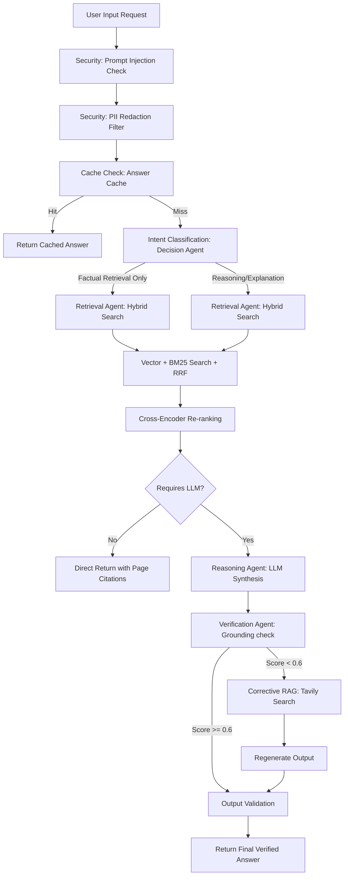

# AI Academic Study Assistant (RAG-First Learning Platform)

A production-grade, AI-powered study platform designed for university classrooms and academic research. Admins control official lecture materials and syllabus knowledge, while students manage their personal notes and publish approved summaries to the community space.

The architecture is built on a **RAG-First, LLM-Second** philosophy: factual queries are resolved directly via vector and full-text keyword indices (bypassing LLM generation), engaging GPT-4o only when comparison, synthesis, or evaluation is requested.

---

## 🏗️ Core Architecture & Pipeline



### Key Subsystems:
1. **Decision Agent**: Classifies user query targets. Routes factual queries (e.g. "What is Deadlock?") to a **Retrieval-Only** path to minimize LLM tokens and ensure strict factual accuracy.
2. **Retrieval Agent**: Connects to Qdrant. Combines dense vector similarity (`text-embedding-3-small`) and BM25 keyword scroll filters using **Reciprocal Rank Fusion (RRF)**, re-ranking matches using simulated Cross-Encoder density.
3. **Reasoning Agent**: Leverages GPT-4o to synthesize answers, make comparisons, and generate roadmaps using retrieved context inputs.
4. **Verification Agent**: Validates claims in generated answers against sources, computing grounding scores to identify and correct hallucinations.
5. **Corrective RAG (CRAG)**: If local datastore verification scores fall below 60%, the orchestrator activates Tavily Search as a fallback context before regeneration.

---

## 🛠️ Technology Stack

* **Frontend**: Next.js (App Router), React, TypeScript, TailwindCSS, Lucide Icons, Glassmorphism theme.
* **Backend**: FastAPI, SQLAlchemy (SQLite out-of-the-box, compatible with PostgreSQL).
* **Vector Store**: Qdrant (supports `:memory:` zero-setup execution or container connections).
* **Caching**: Redis (with memory fallback).
* **Parsing**: `pypdf`, `python-pptx`, `python-docx` for slide and manual parsing.

---

## 🚀 How to Run the Application

You can execute the platform either locally with minimal setup (relying on memory fallbacks) or using Docker Compose.

### Option A: Local Run (Zero-Installation Mode)

This mode runs the vector database and cache in memory, requiring no local Docker or databases.

#### 1. Setup Backend
1. Open a terminal and navigate to the backend directory:
   ```bash
   cd backend
   ```
2. Create and activate a virtual environment:
   ```bash
   python -m venv venv
   # On Windows:
   venv\Scripts\activate
   # On macOS/Linux:
   source venv/bin/activate
   ```
3. Install dependencies:
   ```bash
   pip install -r requirements.txt
   ```
4. Copy the environment variables template and configure keys (e.g., `OPENAI_API_KEY` for LLM support, otherwise Mock-Mode runs locally):
   ```bash
   copy .env.example .env
   ```
5. Launch the FastAPI server:
   ```bash
   python app/main.py
   ```
   The API will be available at `http://localhost:8000` with Swagger docs at `http://localhost:8000/docs`.

#### 2. Setup Frontend
1. Open a new terminal and navigate to the frontend directory:
   ```bash
   cd frontend
   ```
2. Install npm packages:
   ```bash
   npm install
   ```
3. Start the Next.js dev server:
   ```bash
   npm run dev
   ```
   Open `http://localhost:3000` to access the RAG-First Study Assistant interface!

---

### Option B: Docker Compose (Production Ready)

Launch the full-stack system containing Qdrant Server, Redis Cache, FastAPI, and Next.js together.

1. Ensure Docker Desktop is running.
2. In the workspace root, run:
   ```bash
   docker-compose up --build
   ```
3. Services:
   * Next.js Web App: `http://localhost:3000`
   * FastAPI Documentation: `http://localhost:8000/docs`
   * Qdrant Dashboard: `http://localhost:6333/dashboard`

---

## 🧪 Automated Testing

We have built critical verification tests to check the security pipeline, rate limits, RBAC filters, and intent classification.

To run backend tests locally:
```bash
cd backend
pytest tests/
```

---

## 🔒 Security Measures

* **Prompt Injection Detection**: Input queries are checked against injection keyword patterns to prevent jailbreaking.
* **PII Redaction**: Email addresses, US SSNs, and phone numbers are scrubbed from query inputs before search.
* **Role-Based Access Control (RBAC)**: Custom vector filters restrict students from retrieving other students' private notes or pending community items, while allowing admins to view all resources.
* **Rate Limiting**: Rate counters protect the APIs from overload.
* **Grounding Check**: Answers are evaluated against original source pages to prevent hallucinations.
